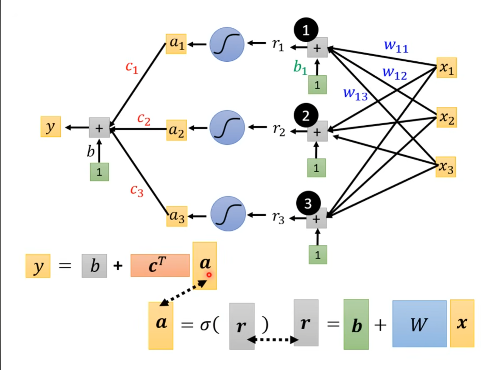

# Concept Hierarchy (from simple to powerful)

## Level 1 — Activation Function (Basic Unit)

- ReLU / Sigmoid / Tanh
- A simple non-linear function

## Level 2 — Neuron

- Applies linear transformation + activation
- $$a = \sigma(w^T x + b)$$
- A layer consists of multiple neurons

## Level 3 — Neural Network

- Combination of multiple neurons
- $$y = b + \sum_i c_i \, \sigma(w_i^T x + b_i)$$
- Neural networks consist of multiple layers of neurons. When the network has many layers, it is referred to as Deep Learning.

## Level 4 — Function Approximation

- Neural networks can approximate complex functions
- With sufficient neurons, can approximate any continuous function

# Activation Function

Activation Function 在 nerual network、deep learning 中是很重要的角色 基本上由此式子組成，而 $\sigma(x)$ 代表一個 function ， 是 activation function 的抽象符號，對 x 套用 activation function  
它可以是 `sigmoid function` 、 `ReLU` 、 `tanh` 、 `GELU` ... 最常直接拿來代表 $Sigmoid$

其中 $Wx$ 的矩陣是常見的 Linear operation 不過
$Wx + b$ 嚴格來說是稱為 affine operation (仿射運算 相對應線性空間)  
activation function 會提供 NN 模型非線性的特性

所以建構 NN 所使用的 activation functions 通常是非線性的  
最重要的目的就是為模型加入非線性的特性 透過非線性的 activation functions 的推疊 模型可以捕捉到複雜的資料背後蘊含的規則

## Piecewise Linear Curves

_ReLU-based neural networks produce piecewise linear functions._

_By combining multiple ReLU units, the model can approximate complex functions._

可以用piecewise linear curves去逼近任何連續的曲線，而piecewise linear又可以用各種activation functions組合而成

## 常見的 activation functions 類型:

### _Sigmoid:_

$$Sigmoid(t) = \frac{1}{1+ e^{-t}}$$

Piecewise Linear Curve $y_{i} = b + \sum_{i} c_{i}\frac{1}{1+ e^{-(b_{i} + w_{i}x_1)}}$
也可以表達為 $y_{i} = b + \sum_{i} c_{i} Sigmoid(b_{i} + \sum w_{ij}x_{j})$

_每個i代表不同的Sigmoid Functions，每個j為不同的狀況、features_

_Function with unknown 可以簡化為 matrix 跟 vector 的表達式_

$$r_{1} = b_{1} + w_{11}x_{1} + w_{12}x_{2} + w_{13}x_{3}$$  
$$r_{2} = b_{2} + w_{21}x_{1} + w_{22}x_{2} + w_{23}x_{3}$$  
$$r_{3} = b_{3} + w_{31}x_{1} + w_{32}x_{2} + w_{33}x_{3}$$

$$
\begin{bmatrix}
r_{1}\\
r_{2}\\
r_{3}
\end{bmatrix}=\begin{bmatrix}
b_{1}\\
b_{2}\\
b_{3}
\end{bmatrix}+\begin{bmatrix}
w_{11} & w_{12} & w_{13}\\
w_{21} & w_{22} & w_{23}\\
w_{31} & w_{32} & w_{33}
\end{bmatrix}\begin{bmatrix}
x_{1}\\
x_{2}\\
x_{3}
\end{bmatrix}
$$

$$
r = b + Wx
$$

$$
a = \sigma(r)
$$

$$
y = \hat{b} + c^T a
$$

Features:

- 1.可微分且有平滑的 gradient
- 2.輸出範圍為 0~1，輸入數值越大（正值）則輸出越接近 1，輸入數值越小（負值）則輸出越接近 0，因此適合做為機率預測模型的輸出層
- 3.當輸入數值大於或小於一定的範圍時，Sigmoid 的輸出差異不大，因此 Gradient 極小，這會導致訓練模型時遭遇梯度消失（vanishing gradients）的問題。這樣的問題在深度模型會更明顯，因為變化極大的輸入經過多次的壓縮到很小的輸出範圍，gradient 更可能小到無法有效訓練模型

### _Tanh:_

_Features:_

- 可微分且有平滑的 gradient
- 與 sigmoid 相似，但輸出範圍為 -1~1。由於輸出以 0 為中心，適合用在預測正向、中性與負向關係模型的輸出層。另外用於 hidden layers 時可以將輸入標準化（normalization）且以 0 為中心，據說（？）有助於後面的 layers 的學習
- 另一個與 sigmoid 相似的點是 tanh 也會遭遇梯度消失（vanishing gradients）的問題，儘管 tanh 的 gradient 已經比 sigmoid 的 gradient 更陡峭

## _Rectified Linear Unit(ReLU):_

ReLU(單一函數):

$$
ReLU(x) = max(0, x)
$$

在Neural Network 中，足夠多的 ReLU units 可以逼近任意函數，包含 sigmoid  
This is a consequence of the Universal Approximation Theorem:

$$
y = b + \sum_{i} c_{i} ReLU(b_{i}+ \sum_{j} w_{ij}x_{j})
$$

$$
y = b + \sum_{i} c_{i} \sigma(b_{i}+\sum w_{ij}x_{j})
$$

Features:

- 只將大於 0 的輸入維持原樣輸出，小於 0 的輸入全都轉換為 0。可以想成只在輸入大於 0 時 activated，計算上比較有效率
- 不會飽和（non-saturating）的特性可免於梯度消失（vanishing gradients）的問題，使得模型更容易收斂，是目前很常使用的 activation function
- 如果輸入都是負的，將會全部被轉換為 0，使得梯度為 0，因此部分的 weights 和 biases 就無法被更新，進而可能使得 neurons 成為永遠不會 activated 的 dead neurons，這會讓訓練模型缺乏效率（Dying ReLU Problem）

  
  
Features:

- 將一個數值陣列轉換為總合為 1 的機率分布，適合做為多類別分類（multi-class classification）模型的輸出層

## 如何選擇 activation function

| Hidden layers                                                                                                       | Output layer                                                                                                                                                   |
| :------------------------------------------------------------------------------------------------------------------ | :------------------------------------------------------------------------------------------------------------------------------------------------------------- |
| 一般同一個模型的所有 hidden layers 都會使用同一種 activation function                                               | 二元分類（Binary classification）：Sigmoid                                                                                                                     |
| 通常會選擇最常使用的 ReLU 開始嘗試，視是否達到預期成果再進行調整                                                    | 多類別分類（Muticlass classification）：Softmax                                                                                                                |
| 避免在非常多層的 network 的 hidden layers 使用 sigmoid 或 tanh，否則很可能遭遇梯度消失（vanishing gradients）的問題 | 多標籤分類（Multilabel classification）：Sigmoid，預測結果可能多於一個 labels，因此每個類別以 0 到 1 的機率個別表示該類別是 label 的機率，所有機率不須總和為 1 |
| 聽說（？） swish 適合用於超過 40 層的 networks，有機會想試試看                                                      | 輸出數值的正負代表正向及負向意義：Tanh                                                                                                                         |

## ⚡ TL;DR

- Activation function 提供非線性能力
- ReLU 最常用（效率高）
- Sigmoid / Tanh 容易梯度消失

## 🔥 My Insight

- Neural network 本質是透過 activation function 組合逼近複雜函數
- $\sigma$ 代表 activation function ， 它是對線性輸出 $(b + Wx)$ 進行一個非線性變換的結果
- Deep learning refers to stacking many layers, enabling hierarchical feature representation
