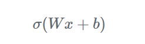
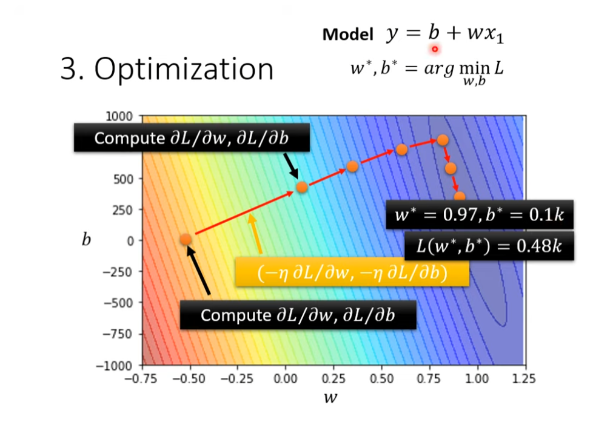

# Define Loss from Training Data

How good a set of values is. The smaller, the better.

Define:

$$L(b, w)$$

$y_{i} = b + wx_i$

- $b$: bias
- $w$: weight

label 在 machine learning 中代表正確答案。

_Loss is defined as:_

$$
L = \frac{1}{n}\sum_{i=1}^{n} e_i
$$

$e$有兩種方法:

### **均方誤差MAE(Mean absolute error)**

$$
e_{i} = |y_{i} - \hat{y}_{i}|
$$

缺點:

- 當兩筆資料的誤差相同，相減為零再取絕對值，此時會出現 `loss = 0` 的問題 (e.g $y=100，\hat{y}=100$)
- optimization比較難
- 在誤差為 0 附近不可微（non-differentiable）
- 對 outlier 不敏感（不像 MSE 會放大誤差）

### **平方誤差MSE(Mean square error)**

$$
MSE = \cfrac{1}{n} \sum_{i=1}^{n} e_i
$$

$$
e_{i} = (y_{i} - \hat{y}_{i})^2
$$

缺點:在單位上較難 or 無法解釋數據，且平方放大誤差

### **RMSE(Root Mean square error)**

$$
RMSE =\sqrt{\cfrac{1}{n} \sum_{i=1}^{n}e_i}
$$

$$
e_{i} = (y_{i} - \hat{y}_{i})^2
$$

If d
$y$
and
$\hat{y}$
are both probability distributions => **Cross-entropy**  
分類問題經常使用**Cross-entropy**

# Optimization

_Gradient Descent_

   
會有 local minimum, global minimum 的問題假議題 之後再更新為何為假議題  
partial的定義:  
對 $w$ partial(把另一個未知數當作常數)  
$$\frac{\partial f}{\partial w}|_{w = w^0, b = b^0}$$

對 $b$ partial  
$$\frac{\partial f}{\partial b}|_{w = w^0, b = b^0}$$

$$
Gradient = \begin{bmatrix}
\frac{\partial L}{\partial \theta_1}\\
\frac{\partial L}{\partial \theta_2}\\
\frac{\partial L}{\partial \theta_3}\\
\frac{\partial L}{\partial \theta_4}\\
.\\
.\\
.
\end{bmatrix}
= g
$$

$$
\theta = \begin{bmatrix}
\theta_1|_{\theta = \theta_0}\\
\theta_2|_{\theta = \theta_0}\\
\theta_3|_{\theta = \theta_0}\\
\theta_4|_{\theta = \theta_0}\\
.\\
.\\
.
\end{bmatrix}
$$

$$
g = \nabla L(\theta^0)
$$

$$
\theta^1 = \theta^0 - \eta g 
$$

### Optimization of New Model
 - (Randomly) Pick initial values $\theta^0$
 - Compute gradient $g =\nabla L(\theta^0)$  
 $
\theta^1 = \theta^0 - \eta g 
$
 - Compute gradient $g =\nabla L(\theta^1)$  
$
\theta^2 = \theta^1 - \eta g 
$
 - Compute gradient  $g =\nabla L(\theta^2)$  
$
\theta^3 = \theta^2 - \eta g 
$

## Piecewise Linear Curves

_Piecewise linear curves = constant + sum set of activation functions_

可以用piecewise linear curves去逼近任何連續的曲線，而piecewise linear又可以用各種activation functions組合而成

## Activation Function

Activation Function 在 nerual network、deep learning 中是很重要的角色 基本上由此式子組成  

其中 $Wx$ 的矩陣是常見的 Linear operation 不過
$Wx + b$ 嚴格來說是稱為 affine operation(仿射運算 相對應線性空間)  
activation function 會提供 NN 模型非線性的特性

所以建構 NN 所使用的 activation functions 通常是非線性的  
最重要的目的就是為模型加入非線性的特性 透過非線性的 activation functions 的推疊 模型可以捕捉到複雜的資料背後蘊含的規則

### 常見的 activation functions 類型:

$$Sigmoid(t) = \frac{1}{1+ e^{-t}}$$

Piecewise Linear Curve $y_{i} = b + \sum_{i} c_{i}\frac{1}{1+ e^{-(b_{i} + w_{i}x_1)}}$
也可以表達為 $y_{i} = b + \sum_{i} c_{i} Sigmoid(b_{i} + w_{i}x_1)(b_{j} + \sum w_{ij}x_{j})$  

_每個i代表不同的Sigmoid Functions，每個j為不同的狀況、features_

_Function with unknown 可以簡化為 matrix 跟 vector 的表達式_

$r_{1} = b_{1} + w_{11}x_{1} + w_{12}x_{2} + w_{13}x_{3}$  
$r_{2} = b_{2} + w_{21}x_{1} + w_{22}x_{2} + w_{23}x_{3}$  
$r_{3} = b_{3} + w_{31}x_{1} + w_{32}x_{2} + w_{33}x_{3}$  
     

$
\begin{bmatrix}
r_{1}\\
r_{2}\\
r_{3}
\end{bmatrix}=\begin{bmatrix}
b_{1}\\
b_{2}\\
b_{3}
\end{bmatrix}+\begin{bmatrix}
w_{11} & w_{12} & w_{13}\\
w_{21} & w_{22} & w_{23}\\
w_{31} & w_{32} & w_{33}
\end{bmatrix}\begin{bmatrix}
x_{1}\\
x_{2}\\
x_{3}
\end{bmatrix}
$

$
r = b + Wx
$

$
a = \sigma(r)
$

$
y = \hat{b} + c^T a
$

Features:

- 1.可微分且有平滑的 gradient
- 2.輸出範圍為 0~1，輸入數值越大（正值）則輸出越接近 1，輸入數值越小（負值）則輸出越接近 0，因此適合做為機率預測模型的輸出層
- 3.當輸入數值大於或小於一定的範圍時，Sigmoid 的輸出差異不大，因此 Gradient 極小，這會導致訓練模型時遭遇梯度消失（vanishing gradients）的問題。這樣的問題在深度模型會更明顯，因為變化極大的輸入經過多次的壓縮到很小的輸出範圍，gradient 更可能小到無法有效訓練模型

Features:

- 可微分且有平滑的 gradient
- 與 sigmoid 相似，但輸出範圍為 -1~1。由於輸出以 0 為中心，適合用在預測正向、中性與負向關係模型的輸出層。另外用於 hidden layers 時可以將輸入標準化（normalization）且以 0 為中心，據說（？）有助於後面的 layers 的學習
- 另一個與 sigmoid 相似的點是 tanh 也會遭遇梯度消失（vanishing gradients）的問題，儘管 tanh 的 gradient 已經比 sigmoid 的 gradient 更陡峭

Features:

- 只將大於 0 的輸入維持原樣輸出，小於 0 的輸入全都轉換為 0。可以想成只在輸入大於 0 時 activated，計算上比較有效率
- 不會飽和（non-saturating）的特性可免於梯度消失（vanishing gradients）的問題，使得模型更容易收斂，是目前很常使用的 activation function
- 如果輸入都是負的，將會全部被轉換為 0，使得梯度為 0，因此部分的 weights 和 biases 就無法被更新，進而可能使得 neurons 成為永遠不會 activated 的 dead neurons，這會讓訓練模型缺乏效率（Dying ReLU Problem）

  
  
Features:

- 將一個數值陣列轉換為總合為 1 的機率分布，適合做為多類別分類（multi-class classification）模型的輸出層

### 如何選擇 activation function

| Hidden layers                                                                                                       | Output layer                                                                                                                                                   |
| :------------------------------------------------------------------------------------------------------------------ | :------------------------------------------------------------------------------------------------------------------------------------------------------------- |
| 一般同一個模型的所有 hidden layers 都會使用同一種 activation function                                               | 二元分類（Binary classification）：Sigmoid                                                                                                                     |
| 通常會選擇最常使用的 ReLU 開始嘗試，視是否達到預期成果再進行調整                                                    | 多類別分類（Muticlass classification）：Softmax                                                                                                                |
| 避免在非常多層的 network 的 hidden layers 使用 sigmoid 或 tanh，否則很可能遭遇梯度消失（vanishing gradients）的問題 | 多標籤分類（Multilabel classification）：Sigmoid，預測結果可能多於一個 labels，因此每個類別以 0 到 1 的機率個別表示該類別是 label 的機率，所有機率不須總和為 1 |
| 聽說（？） swish 適合用於超過 40 層的 networks，有機會想試試看                                                      | 輸出數值的正負代表正向及負向意義：Tanh                                                                                                                         |

# Machine Learning steps

Machine Learning tasks include:
- Regression
- Classification
- Structured prediction (optional)

## Step 1. Function with unknown

**_Model:_**

$$y=b+wx$$

## Step 2. Define Loss from Training data

Loss is a function of parameters e.g. $L(b,w)$  
 Loss: $L=\frac{1}{N}( Σ(e) ) e$ 為每筆資料的預設跟實際的誤差，N 為總資料數  
 Loss 越大代表參數越差  
 計算誤差的方式:  
 $e=|y-y'|$ L is mean absolute error(MAE)  
 $e=(y-y')^2$ L is mean square error(MSE)  
 如果 y 為機率表示的話=>Cross-entropy

## Step 3. Optimization

Gradient Descent  
 

- (Randomly) Pick an initial value $w_1$
- Compute $\frac{L'}{w'}| w = w_{1}$ , Negative => Increase Positive => decrease $w$
- Update $w$ iteratively

  

## Cross-entropy

cross-entropy 是用來觀測預測的機率分布與實際機率分布的誤差範圍  
corss-entropy 越高，代表內涵的資訊量越大，不確定越多，誤差越高  
[何謂 Cross-Entropy (交叉熵)](https://r23456999.medium.com/%E4%BD%95%E8%AC%82-cross-entropy-%E4%BA%A4%E5%8F%89%E7%86%B5-b6d4cef9189d)

| Loss          | 特點                     | 適用             |
| ------------- | ---------------------- | -------------- |
| MAE           | robust to outliers     | regression     |
| MSE           | penalizes large errors | regression     |
| Cross-entropy | probability comparison | classification |
